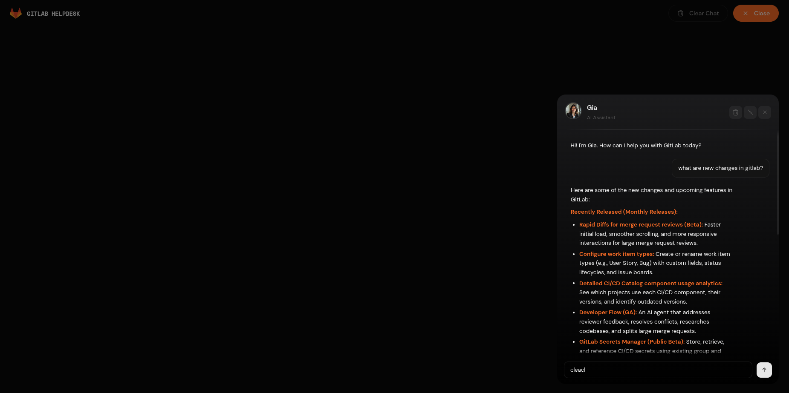

<div align="left">

# GitLab Helpdesk AI

**A smart, fast, and production-ready RAG chatbot for GitLab's Handbook.**


<br />

[](https://gitlabhelpdesk.vercel.app/)
<br />
[](https://gitlabhelpdesk.vercel.app/docs)
<br />
[](https://gitlabhelpdesk.vercel.app/video)
<br />
[](https://gitlabhelpdesk.vercel.app/setup)


</div>

## Tech Stack

| | Technology | Description |
| :---: | :--- | :--- |
|   | **React + Vite** | High-performance frontend UI with dark mode and glassmorphism. |
|  | **TypeScript** | Strongly typed frontend code for safety and scale. |
|  | **FastAPI** | Python backend handling concurrent RAG logic and real-time SSE streaming. |
|  | **Google Gemini 2.5 Flash** | Cutting-edge LLM for reasoning, embeddings, and query classification. |
|  | **ChromaDB** | Local persistent vector database holding 900+ scraped GitLab Handbook chunks. |
|  | **Python 3** | Backend runtime powering the RAG pipeline, scraper, and API layer. |


## Features

- **Real-Time Streaming** — The AI types out its answers live (just like ChatGPT) via Server-Sent Events, drastically reducing perceived latency.
- **Dynamic Context Windows** — Uses `tiktoken` to mathematically manage the LLM's memory, so the app never crashes from "Token Limit Exceeded" errors during long chats.
- **Persistent Sessions** — Your chat history is automatically saved to your browser (`localStorage`). Refresh the page and your conversation is still there.
- **Graceful Degradation** — The backend handles API rate limits (HTTP 429) with exponential backoff. If all retries fail, the user gets a friendly message instead of a raw stack trace.
- **Source Citations** — Every answer includes deduplicated source links pulled directly from the GitLab Handbook.


## Screenshots

<div align="center">
  
  <br /><br />
  
</div>

---

## Local Setup

You will need two terminal windows — one for the **Backend** and one for the **Frontend**.

### 1. Start the Backend (Python)

```bash
cd backend
python3 -m venv venv
source venv/bin/activate
pip install -r requirements.txt
uvicorn api.main:app --reload
```

> Backend will be running on **http://127.0.0.1:8000**

### 2. Start the Frontend (React)

```bash
cd frontend
npm install
npm run dev
```

> Frontend will be running on **http://localhost:5173**

Open your browser, go to `http://localhost:5173`, and start chatting with **Gia**!