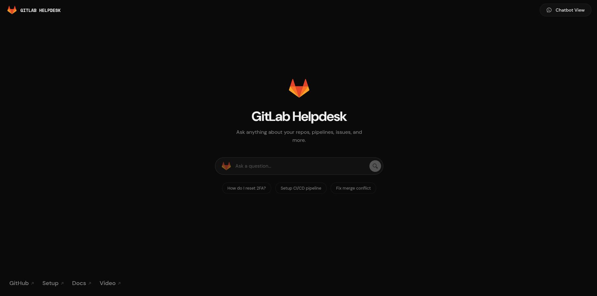
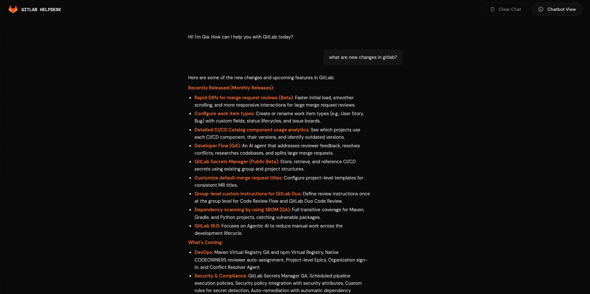

<div align="left">
  <h1>GitLab Helpdesk AI</h1>
  <p>A smart, fast, and production-ready RAG chatbot for GitLab's Handbook.</p>

  
</div>

<br />

## Links

- **Check the site:** [/homepage](https://gitlabhelpdesk.vercel.app/)
- **Explore how I made this application:** [/docs](https://gitlabhelpdesk.vercel.app/docs)
- **Want to Setup this app locally? :** [/setup](https://gitlabhelpdesk.vercel.app/setup)
- **I also Explained my working here:** [/video](https://gitlabhelpdesk.vercel.app/video)
---

## 🛠️ Tech Stack

| Icon | Technology | Description |
| :---: | :--- | :--- |
|  | **React + Vite** | High-performance frontend UI with dark mode and glassmorphism. |
|  | **TypeScript** | Strongly typed frontend code for safety and scale. |
|  | **FastAPI** | Python backend handling concurrent RAG logic and real-time SSE streaming. |
| <svg xmlns="http://www.w3.org/2000/svg" width="30" height="30" fill="currentColor" viewBox="0 0 24 24" aria-label="Gemini"><path d="M12 2c-.78 5.16-4.84 9.22-10 10 5.16.78 9.22 4.84 10 10 .78-5.16 4.84-9.22 10-10-5.16-.78-9.22-4.84-10-10"/></svg> | **Google Gemini** | Driven by the cutting-edge Gemini 2.5 Flash model for reasoning. |
| <svg xmlns="http://www.w3.org/2000/svg" width="30" height="30" fill="currentColor" viewBox="0 0 24 24" aria-label="ChromaDB"><path d="M12 2c-.78 5.16-4.84 9.22-10 10 5.16.78 9.22 4.84 10 10 .78-5.16 4.84-9.22 10-10-5.16-.78-9.22-4.84-10-10"/></svg> | **ChromaDB** | Local persistent vector database securely holding 900+ scraped GitLab handbook documents. |


## Features

- **Real-Time Streaming:** The AI types out its answers live (just like ChatGPT) via Server-Sent Events, drastically reducing perceived latency.
- **Dynamic Context Windows:** Uses `tiktoken` to mathematically manage the LLM's memory, ensuring the app never crashes from "Token Limit Exceeded" errors during long chats.
- **Persistent Sessions:** Your chat history is automatically saved to your browser (`localStorage`). If you refresh the page, your conversation is perfectly preserved.
- **Graceful Degradation:** The backend automatically handles API rate limits (HTTP 429) using exponential backoff, and failing that, gently tells the user to try again instead of exposing raw JSON stack traces.
- **Source Citations:** Instantly pulls deduplicated source references for every answer directly from the GitLab Handbook.


## Local Setup

It's very easy to run this project locally. You will need to start both the **Backend** and the **Frontend** in two separate terminal windows.

### 1. Start the Backend (Python)
Open your first terminal window and run:

```bash
cd backend
python3 -m venv venv
source venv/bin/activate
pip install -r requirements.txt
uvicorn api.main:app --reload
```
*(The backend will now be running on http://127.0.0.1:8000)*

### 2. Start the Frontend (React)
Open a **new**, second terminal window and run:

```bash
cd frontend
npm install
npm run dev
```
*(The frontend will now be running on http://localhost:5173)*

Open your browser, go to `http://localhost:5173`, and start chatting with Gia!
## Screenshots

<div align="center">
  
  &nbsp;
  
</div>